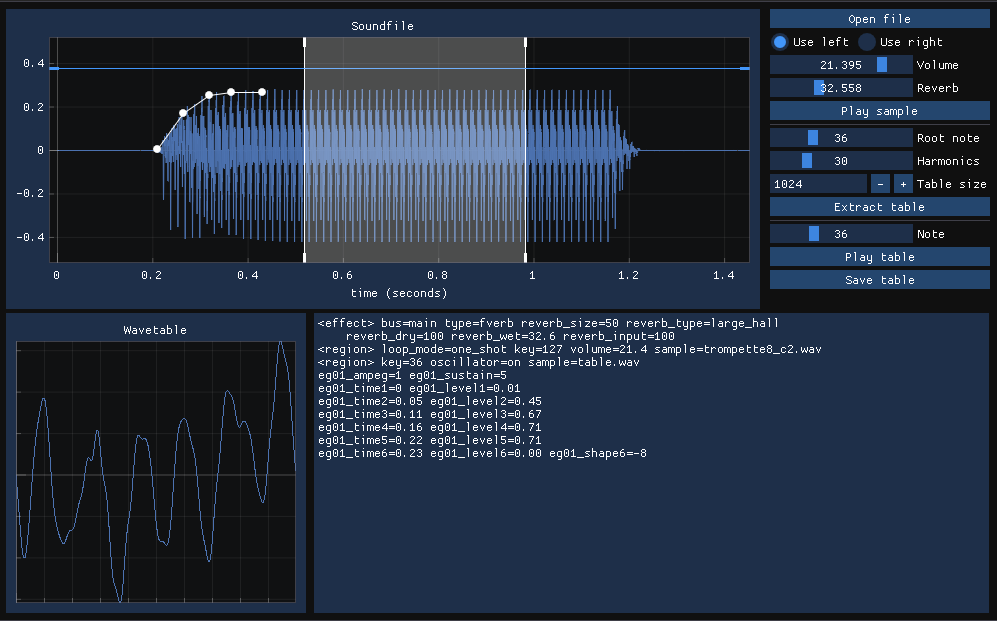

# wextract

Cross-platform tool to extract wavetables and draw envelopes from sample files, exporting the wavetable and generating the appropriate SFZ text to use in [sfizz] or [Sforzando].



## Usage:

- Open a file and select the left/right channel to use as a source.
- Select the range from which you would want to extract the wavetable.
- Set the root note and number of harmonics to gather at most.
- Extract the wavetable and compare with the source sample.
- You can build an envelope for the wavetable: use <kbd>Ctrl</kbd>+click to add envelope points on the source file, and double click to remove them. You can also set the sustain level, so that envelope points are computed relative to this level. The output SFZ file contains the flex envelope opcodes should you want to save them.
- You can save the wavetable when you're happy with it !

## Still to do:
- UI QoL stuff (mouse release while dragging, ...)
- Tweak the signal processing for large numbers of harmonics

## Building

Clone the repository using the `--recursive` flag to gather all submodules.
If not, you will need to additionally run `git submodule update --init`.
The build process requires `cmake`.
The program depends on `libsfizz` on Linux, you can download your appropriate package on [OBS]; Windows dlls are bundled.

```sh
git clone https://github.com/paulfd/wextract --recursive
cd wextract
mkdir build && cd build
cmake -DCMAKE_BUILD_TYPE=Release ..
cmake --build . -j
```

## Licenses

- [sfizz], by SFZTools: BSD 2-Clause License
- [Eigen], by Benoit Jacob, Gaël Guennebaud and contributors: Mozilla Public License v2
- [fmt], by Victor Zverovich: MIT License
- [GLFW], by Marcus Geelnard and Camilla Löwy: Zlib license
- [imgui], by Omar Cornut and contributors: MIT License
- [implot], by Evan Pezent: MIT License
- [imgui-filebrowser], by AirGuanZ: MIT License
- [kissfft], by Mark Borgerding: BSD 3-clause License
- [miniaudio], by David Reid: Public Domain
- The icon is by [Becris]

[sfizz]:     https://sfz.tools/sfizz/
[Sforzando]:     https://www.plogue.com/products/sforzando.html
[OBS]:     https://software.opensuse.org//download.html?project=home%3Asfztools%3Asfizz&package=sfizz
[Becris]: https://creativemarket.com/Becris
[Eigen]: https://eigen.tuxfamily.org
[fmt]: https://github.com/fmtlib/fmt
[GLFW]: https://github.com/glfw/glfw
[imgui]: https://github.com/ocornut/imgui
[implot]: https://github.com/epezent/implot
[imgui-filebrowser]: https://github.com/AirGuanZ/imgui-filebrowser
[kissfft]: https://github.com/mborgerding/kissfft
[miniaudio]: https://github.com/mackron/miniaudio
